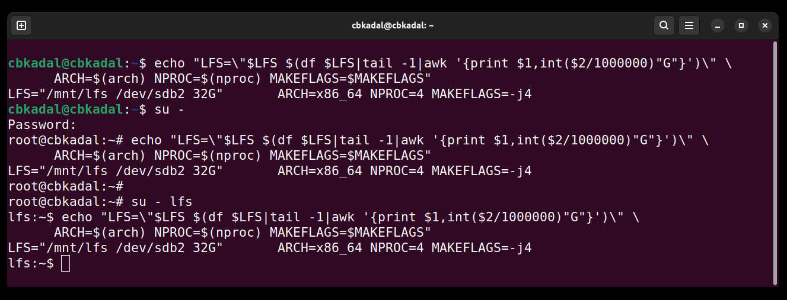

# OS Week 10 Assignment #3: Linux From Scratch 12.1 Ch. 8
## Preparation <span style="color:red; font-weight:bold; font-size:larger;">(IMPORTANT!)</span>
### Check file system /mnt/lfs

```
df | grep lfs

```


<br>
<span style="color:red; font-weight:bold; font-size:larger;">
If there is no "/mnt/lfs", see [here](../W03-03).
</span>

## Three (3) Accounts
* your own account, e.g., <span style="color:red; font-weight:bold; font-size:larger;">(user cbkadal)</span>
* root account <span style="color:red; font-weight:bold; font-size:larger;">(root)</span>
* lfs account <span style="color:red; font-weight:bold; font-size:larger;">(user lfs)</span>

### Check ALL environments for ALL accounts (cbkadal, root, lfs):

```
echo "LFS=\"$LFS $(df $LFS|tail -1|awk '{print $1,int($2/1000000)"G"}')\" \
      ARCH=$(arch) NPROC=$(nproc) MAKEFLAGS=$MAKEFLAGS"

```


<br>

<br>
## Follow "The Linux From Scratch version 12.1 Book" chapter 6-7
* VirtualBox (AMD64)
    * [The Linux From Scratch version 12.1 Book](https://www.linuxfromscratch.org/lfs/view/12.1/)
  ([mirror1](https://lfs.mirrors.hoobly.com/lfs/view/12.1/))
  ([mirror2](https://lfs-hk.koddos.net/lfs/view/12.1/))
  ([mirror3](https://lfs.opensource.foundation/lfs/view/12.1/))
* UTM/M1 (ARM64/AARCH64)
    * [The Linux From Scratch ARM64/AARCH64 Book](https://www.linuxfromscratch.org/~xry111/lfs/view/arm64/)
    * <span style="color:red; font-weight:bold; font-size:larger;">COMPARE</span><br>
    <b>LFS ARM64/AARCH64</b> is not an official version (KW) and changes frequently.
    Therefore, it is recommended to use a package similar to the official version of LFS 12.1 (ORI).
    Because of this, the instructions for the KW version packages often
    <span style="color:red; font-weight:bold; font-size:larger;">differ</span>
    from those for the ORI.  Since it uses the ORI package, it must sometimes be compiled using the ORI method.
    Please be careful, especially when working on chapter 8 and explicitly compiling GCC (chapter 8.27).
        * <span style="color:red; font-weight:bold; font-size:larger;">VISIT</span>
      <https://yforku.github.io/os242/LFS/>.
* Source Code Mirrors:
  ([source mirror1](https://lfs.gnlug.org/pub/lfs/lfs-packages/12.1/))
  ([source mirror2](https://mirror.fileplanet.com/lfs/pub/lfs/lfs-packages/12.1/))
  ([source mirror3](https://mirror.koddos.net/lfs/lfs-packages/12.1/))
* [Kernotex's YouTube LFS 12.1 PlayList](https://www.youtube.com/playlist?list=PLyc5xVO2uDsCKdz6-Ojah0o-ZTqGE7HEX)
    * [Kernotex's Host Linux configuration for LFS Chapter 2.2 - "Host System Requirements"](https://www.youtube.com/playlist?list=PLyc5xVO2uDsCQChvKRDhF-cvsguDfd-y2)
    * [Kernotex's LFS in VirtualBox](https://www.youtube.com/playlist?list=PLyc5xVO2uDsB4gJ2dPySvs2eK_roFwKeb)

## <span style="color:red; font-weight:bold; font-size:larger;">Take Note!</span>

### You might want to combine the commands in chapter 7.2-7.4 <span style="color:red; font-weight:bold; font-size:larger;">(root)</span>

```
echo "= (1) ======================================"; sleep 1
echo "LFS=$LFS NPROC=$(nproc) MAKEFLAGS=$MAKEFLAGS"
echo "= (2) ======================================"; sleep 1
chown -R root:root $LFS/{usr,lib,var,etc,bin,sbin}
[ -d $LFS/tools/ ] && chown -R root:root $LFS/tools/
case $(uname -m) in
  x86_64) chown -R root:root $LFS/lib64 ;;
esac
mkdir -pv $LFS/{dev,proc,sys,run}
echo "= (3) ======================================"; sleep 1
systemctl daemon-reload
mount -v --bind /dev $LFS/dev
mount -v --bind /dev/pts $LFS/dev/pts
mount -vt  proc proc  $LFS/proc
mount -vt sysfs sysfs $LFS/sys
mount -vt tmpfs tmpfs $LFS/run
echo "= (4) ======================================"; sleep 1
if [ -h $LFS/dev/shm ]; then
  mkdir -pv $LFS/$(readlink $LFS/dev/shm)
else
  mount -t tmpfs -o nosuid,nodev tmpfs $LFS/dev/shm
fi
echo "= (5) ======================================"; sleep 1
df /
echo "= (6) ======================================"; sleep 1
chroot "$LFS" /usr/bin/env -i   \
    HOME=/root                  \
    TERM="$TERM"                \
    PS1='(lfs chroot) \u:\w\$ ' \
    PATH=/usr/bin:/usr/sbin     \
    MAKEFLAGS=-j$(nproc)        \
    /bin/bash --login

```

### The FIRST TIME chroot RESULT

```
(lfs chroot) I have no name!:/#

```

## <span style="color:red; font-weight:bold; font-size:larger;">AARCH64 (UTM) and ARM64 (VirtualBox)</span>

* Chapter 8.5. Glibc-2.39 (locale)
  * <span style="color:red; font-weight:bold; font-size:larger;">SKIP</span> "make localedata/install-locales"
  * Or, your file "/lib/locale/locale-archive" size will be humongous.

* Chapter 8.5. (cont.)
  * Time Zone: Asia/Jakarta

```
ln -sfv /usr/share/zoneinfo/Asia/Jakarta /etc/localtime

```

* Chapter 8.62. Groff-1.23.0
  * Paper Size="A4"

```
PAGE=A4 ./configure --prefix=/usr

```

## Last, run <span style="color:red; font-weight:bold; font-size:larger;">(user)</span>:

```
export LFS="/mnt/lfs/"
cd $HOME/mywork/WEEK10/
bash 10_WEEK10.sh

```

## Result/Report

```
cd $HOME/RESULT/W10/
ls -al

```
