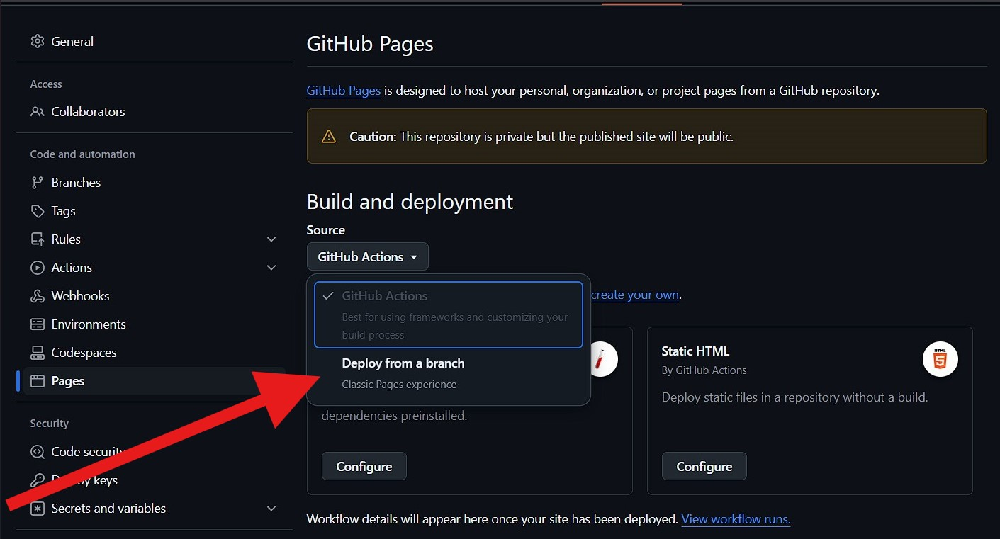
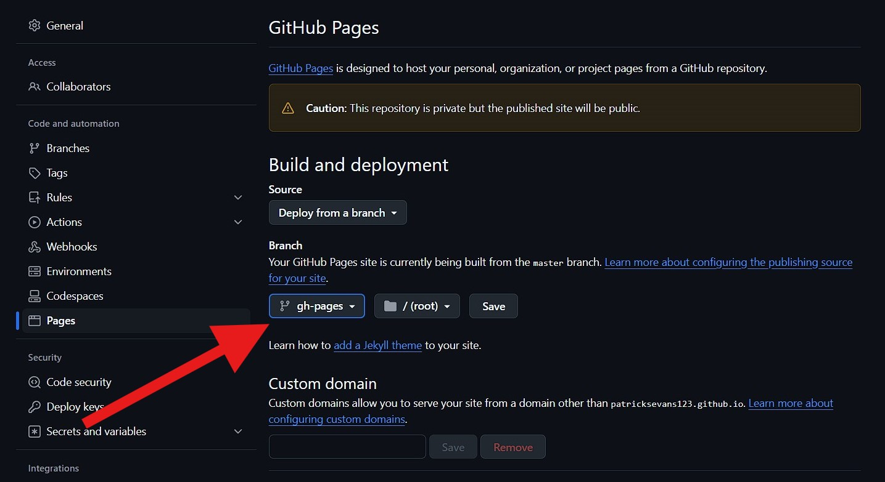
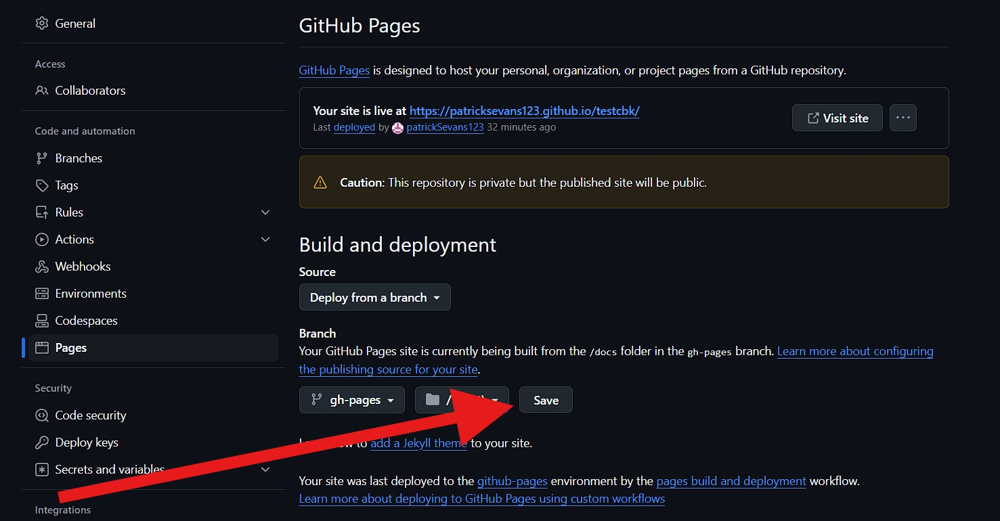
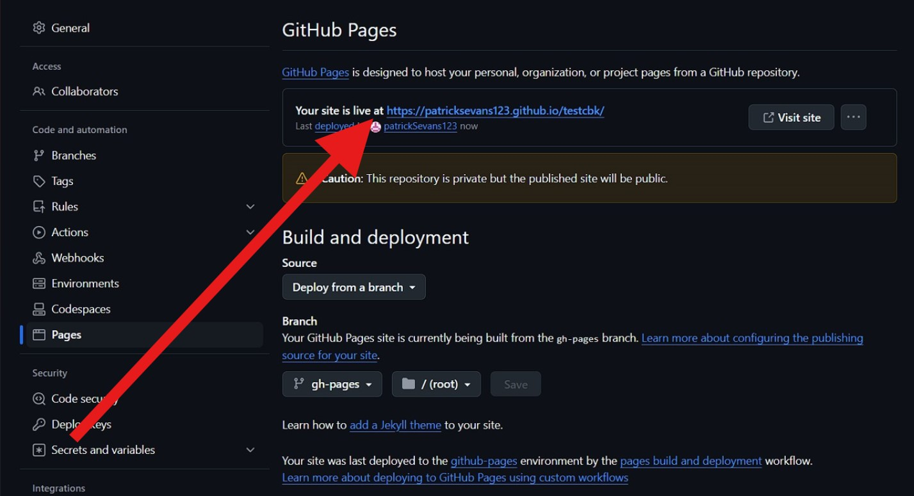
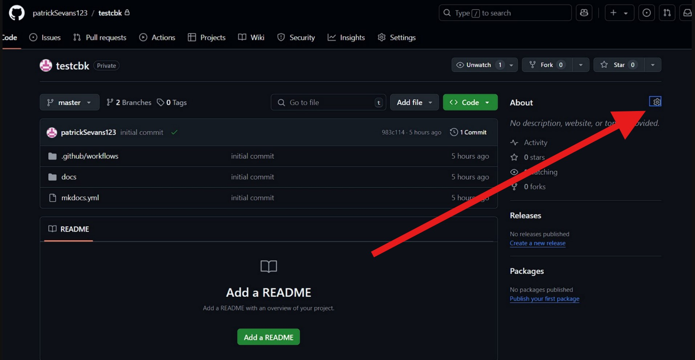
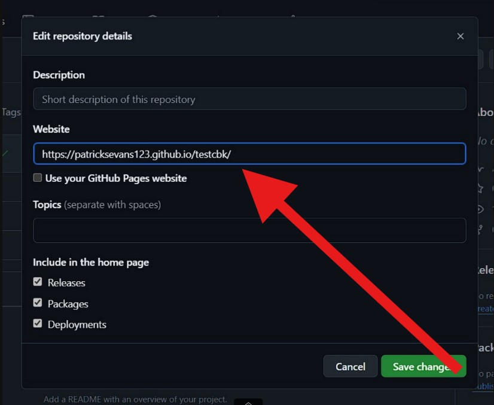

## How to Prepare the Source Code

- **Download the Source Code:**  
   Click the link below to download the latest version of the source code as a ZIP file:  
   [Download Source Code](https://github.com/cbk2000/mkdocs-os-cbk/archive/refs/heads/master.zip)

- **Extract the ZIP File:**  
   Once downloaded, unzip the `mkdocs-os-cbk-master.zip` file to access the source code files.

- **Create Your GitHub Repository and Push Initial Changes**  
  Start by creating a GitHub repository to host your MkDocs project if you haven’t already.  
  [Create New Repository on GitHub](https://github.com/new)

    Once your repository is ready, use the following commands to set it up locally, add your files, commit, and push them to GitHub. After this initial push, a `gh-pages` branch will be created automatically:

```bash
git init
git remote add origin <your github repository link>
git branch -M master
git add .
git commit -m "<your message>"
git push -u origin master
```

* **Set Up GitHub Pages Deployment:**  
    - Go to your repository’s settings, open the **Pages** section, and set the source to **Deploy from a branch**.  
     
    - Set the deployment branch to `gh-pages`.  
     
    - Save your changes.  
     

* **Access Your Deployed Site and Add the Deployed Site Link to Repository Details:**  
    - After the workflow completes successfully, refresh the GitHub Pages section and visit the GitHub Pages URL to access your MkDocs site.  
   
   
    - To make it easy for visitors to find your site, add the GitHub Pages URL to the repository details or the README file.  
     
    - In the "About" section, click the gear icon to add the URL under "Website" and save your changes.  
     
    - Save your changes.